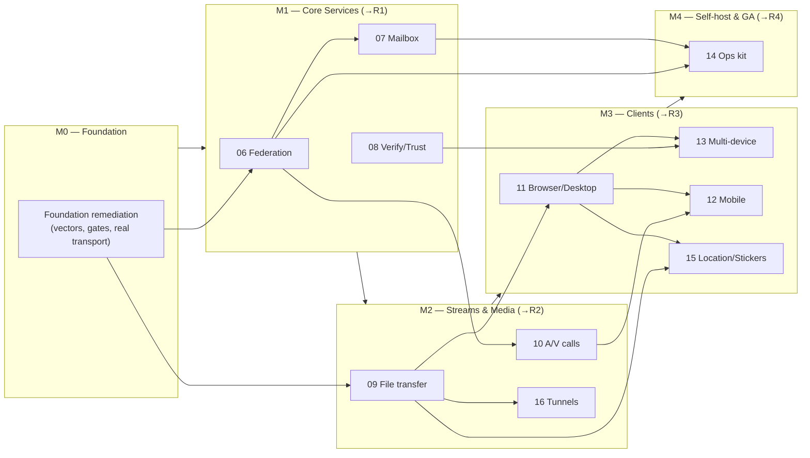

<!-- The end-to-end delivery program for Meridian: foundation remediation (from the Features 1–5 review)
     THROUGH Features 06–16, with a full review phase after every milestone. This is the single "where are
     we" map. Feature *specs* remain canonical in docs/architecture/features/; this plan sequences and
     decomposes the work to build them. -->
> **Nav:** [docs index](../../INDEX.md) · [roadmap](../roadmap.md) · [system design](../system-design.md) · [feature specs](../features/) · [ADR index](../../adr/README.md) · [Definition of Done](../../../CONTRIBUTING.md) · [test strategy](../../testing/strategy.md)

# Meridian — End-to-End Implementation Program

This is the **whole journey in one place**: from fixing the issues the Features 1–5 review surfaced,
through building every remaining feature (06–16), to GA. It is organised into **milestones**; after each
milestone a **review phase** repeats the kind of security-weighted, five-area review we ran on Features
1–5, so defects introduced in that milestone's phases are caught and fixed *before* the next milestone
builds on them.

- **Foundation remediation** (the review findings) → **[Milestone M0](#milestone-m0--foundation-remediation)**: 6 phases, 37 tasks.
- **Feature delivery** (06–16) → **Milestones M1–M4**: one folder per feature, each decomposed into tasks.
- **Review gates** → **R1–R4**: a review phase closing each milestone (R0 = the original Features 1–5 review that started all this).

## Where are we right now (status dashboard)

> **You are here:** Features 01–05 are shipped. The Features 1–5 review (**R0**) is complete and produced
> Milestone M0. **M0 is fully planned; task execution has not started.** Everything in M1–M4 is planned at
> the task level and will be built after M0 clears. **Next action:** run
> [`/next-task`](../../../.claude/commands/next-task.md) — it selects **T0.1** (the first unblocked task).

| Milestone | Scope | Planning | Build | Closing review | State |
|---|---|---|---|---|---|
| **Features 01–05** | Identity → NAT/relay (critical path) | ✅ | ✅ shipped | ✅ **R0** done | **Done** |
| **[M0](#milestone-m0--foundation-remediation)** | Foundation remediation (review findings) | ✅ complete | ☐ not started | Phase‑5 checkpoint | **Planned → build next** |
| **[M1](#milestone-m1--core-services--protocol-trust)** | Federation · Verification/Trust · Mailbox | ✅ complete | ☐ | **R1** | Planned |
| **[M2](#milestone-m2--rich-streams--real-time-media)** | File transfer · A/V calls · Tunnels | ✅ complete | ☐ | **R2** | Planned |
| **[M3](#milestone-m3--clients--multi-device)** | Browser/Desktop · Multi‑device · Mobile · Location/Stickers | ✅ complete | ☐ | **R3** | Planned |
| **[M4](#milestone-m4--self-hosting--ga)** | Self‑hosting ops kit · GA hardening | ✅ complete | ☐ | **R4 / GA** | Planned |

Legend: ✅ done · ◐ in progress · ☐ not started. Each phase/feature folder tracks its own task-level
status; this table is the roll-up. Update the roll-up whenever a milestone changes state.

## How this program is organised

```
implementation-plan/
├── README.md                       ← you are here: the program map + status
├── review-phase-template.md        ← the reusable structure every review gate (R1–R4) instantiates
│
│   ── Milestone M0 — Foundation remediation (per-task files; in-flight) ──
├── phase-0-truth-restoration/      ├ 6 phases, 37 tasks, one file per task
├── phase-1-ci-gates/               │
├── phase-2-crypto-freeze/          │
├── phase-3-transport-backend/      │
├── phase-4-deferred-correctness/   │
├── phase-5-ga-readiness/           ┘ (Phase 5 = M0's exit checkpoint)
│
│   ── Milestones M1–M4 — feature delivery (task breakdown in each feature README) ──
├── feature-06-cross-org-federation/   … one folder per feature 06–16, each a README with its tasks
├── feature-08-verification-trust/
├── feature-07-offline-mailbox/
├── review-r1-core-services/           ← review phase closing M1
├── feature-09-file-transfer/  … feature-10 … feature-16 …
├── review-r2-streams-media/
├── feature-11-browser-desktop-clients/  … 13 … 12 … 15 …
├── review-r3-clients/
├── feature-14-selfhosting-ops-kit/
└── review-r4-ga-signoff/
```

**Task-ID → location.** Remediation tasks are `T<phase>.<n>` (e.g. `T2.1`) in
`phase-<phase>-<slug>/`. Feature tasks are `F<NN>.<n>` (e.g. `F06.3`) and live as sections in
`feature-<NN>-<slug>/README.md`. Review-gate remediation tasks are `R<n>.<m>`, added to the review
folder once that review runs.

**Progressive elaboration (deliberate).** M0 is exploded into one file per task because it is the work
in flight and needs fine-grained tracking. Features 06–16 are documented to the **task level inside each
feature's README** — every task named with its scope, deliverables, tests, DoD, dependencies, and review
tags — but are *not* pre-exploded into per-task files. Those files are materialised when the milestone is
entered (by `/next-task` or a short planning pass), because **each review gate is designed to re-plan**:
writing dozens of separate task files that R1/R2/R3 will revise is waste. Nothing is undocumented — the
later work is fully planned, just held one elaboration step back until its review-informed inputs exist.

**Every task (remediation or feature) carries the same fields:** Scope · Touches (with **[ADR]** and
**[SEC]** tags) · Deliverables · Tests · Verification (DoD by number) · Depends on · Status · Pre-build
review. See the [Definition of Done](../../../CONTRIBUTING.md).

## The review phases (why they exist, how they run)

R0 — the Features 1–5 review — found that the *code* was sound but *guardrails, conformance vectors, and
real transport* were not, and that drift had crept into docs/ADRs. That is exactly the failure mode a
milestone can hide. So **every milestone ends with a review phase** that re-runs the same five-area,
security-weighted review over everything that milestone touched:

1. Security review of the milestone's most sensitive change (crypto/keys/identity/signaling/storage/logging/metrics/federation).
2. Completed-work review against each feature spec and the Definition of Done.
3. Missing-task sweep (tests, docs/diagram sync, conformance vectors, error handling at trust boundaries).
4. Gaps needing new steps (where the built state diverges from the design).
5. Future-risk callouts (architectural, security, operational).

The review is delegated to the `security-reviewer`, `architect`, and `test-engineer` subagents (as R0
was), produces a findings report in the review folder, and **decomposes its findings into `R<n>.<m>`
remediation tasks that are fixed inside that review phase** before the next milestone starts. The
reusable structure is [`review-phase-template.md`](./review-phase-template.md).

## Dependency map (features → milestones)



Milestones run in order M0→M4 so each review gate fires before the next milestone builds. Within the
dependency rules, some later work *may* start early (e.g. Feature 14 absorbs federation/mailbox hardening
as soon as M1 lands); the linear milestone sequence is the review discipline, not a hard serialization of
every task.

---

# Milestones

## Milestone M0 — Foundation Remediation

Fixes the R0 findings. 6 phases, 37 tasks, one file per task. Phases 0–1 are pure-guardrail (doc truth +
CI enforcement) and land first; Phase 5 is M0's exit checkpoint. Full detail, the R0 finding→task
traceability map, and the ADR/SEC review-routing lists are in **[Part A/C/D below](#m0-detail)**.

| Phase | Theme | Tasks |
|---|---|---|
| [0 — Truth restoration](./phase-0-truth-restoration/README.md) | Doc & ADR integrity | 6 |
| [1 — CI gates](./phase-1-ci-gates/README.md) | Make the enforcement layer real | 10 |
| [2 — Crypto freeze](./phase-2-crypto-freeze/README.md) | Conformance vectors + key hygiene | 7 |
| [3 — Transport backend](./phase-3-transport-backend/README.md) | Real WebRTC; close F04/F05 | 8 |
| [4 — Deferred correctness](./phase-4-deferred-correctness/README.md) | Gaps inside completed features | 4 |
| [5 — GA readiness](./phase-5-ga-readiness/README.md) | External review + roadmap hand-back | 2 |

## Milestone M1 — Core Services & Protocol Trust

The federation + trust + async-delivery layer that turns two isolated stacks into a federated,
verifiable, offline-capable network. Build order respects dependencies; 08 may run in parallel with 06.

| Feature | Folder | Depends on | Why it's here |
|---|---|---|---|
| 06 — Cross-Org Federation | [feature-06](./feature-06-cross-org-federation/README.md) | 04 (M0 transport) | Requirement-3 proof; unblocks 07/10/14 |
| 08 — Verification & Contact Trust | [feature-08](./feature-08-verification-trust/README.md) | 03 | Why the system survives malicious servers; unblocks 13 |
| 07 — Offline Ciphertext Mailbox | [feature-07](./feature-07-offline-mailbox/README.md) | 03, 06 | Async delivery; unblocks 14 |
| **Review R1** | [review-r1](./review-r1-core-services/README.md) | 06, 07, 08 | Federation/trust/retention review + fixes |

## Milestone M2 — Rich Streams & Real-Time Media

Proves the T04 stream-type extension contract (file transfer with zero core edits), then media, then the
"ultimate sharing platform" tunnels.

| Feature | Folder | Depends on | Why it's here |
|---|---|---|---|
| 09 — File Transfer Stream | [feature-09](./feature-09-file-transfer/README.md) | 04, M0 transport | First non-chat stream; validates the registry contract |
| 10 — Voice/Video/Screenshare | [feature-10](./feature-10-av-calls-screenshare/README.md) | 05, 06 | Media stream types; cross-org calls |
| 16 — Tier-2 Tunnels | [feature-16](./feature-16-tier2-tunnels/README.md) | 09 | SSH/fs over P2P; the payoff task |
| **Review R2** | [review-r2](./review-r2-streams-media/README.md) | 09, 10, 16 | Media/transport/stream-contract review + fixes |

## Milestone M3 — Clients & Multi-Device

The shared-core/thin-shim strategy across browser, desktop, mobile, plus multi-device and the last
Tier-1 stream types.

| Feature | Folder | Depends on | Why it's here |
|---|---|---|---|
| 11 — Browser & Desktop Clients | [feature-11](./feature-11-browser-desktop-clients/README.md) | 04–09 | WASM core + Tauri; interop with CLI |
| 13 — Multi-Device | [feature-13](./feature-13-multi-device/README.md) | 08, 11 | Device records, ghost-device detection |
| 12 — Mobile Clients | [feature-12](./feature-12-mobile-clients/README.md) | 10, 11 | Android/iOS over UniFFI; content-free push |
| 15 — Location & Stickers | [feature-15](./feature-15-location-stickers/README.md) | 09, 11 | Last Tier-1 stream types |
| **Review R3** | [review-r3](./review-r3-clients/README.md) | 11, 12, 13, 15 | Client attack-surface/push/multi-device review + fixes |

## Milestone M4 — Self-Hosting & GA

Operational completeness and the GA gate — including the external crypto review the composed ratchet
needs (seeded by M0 Phase 5 / T5.1).

| Feature | Folder | Depends on | Why it's here |
|---|---|---|---|
| 14 — Self-Hosting Ops Kit | [feature-14](./feature-14-selfhosting-ops-kit/README.md) | 06, 07 | Air-gapped install, dashboards, runbooks |
| **Review R4 / GA sign-off** | [review-r4](./review-r4-ga-signoff/README.md) | all | Whole-system review + GA gate |

---

<a id="m0-detail"></a>
# M0 detail — baseline, traceability, review routing

## Part A — Completed work (baseline, carried forward as done)

Features 01–05 are **done** and are not re-planned. Where the review found a gap *inside* a completed
feature, the gap is a remediation task (Part C) — the feature itself stands.

| # | Feature | Status | Verified by |
|---|---------|--------|-------------|
| 01 | Identity & Keystore Core | **Done** | `meridian-identity` + CLI; `test-vectors/identity-v1.json` consumed by `apps/identity/tests/conformance.rs`; 10⁶ fuzz + flipped-bit + same-principal + plaintext-never-on-disk pass |
| 02 | Rendezvous Server MVP | **Done** | `meridian-rendezvous` binary + Dockerfile; challenge/response auth, exact-key bundle fetch, fail-closed tampered-bundle abort; opaque routing |
| 03 | E2EE Messaging (relayed) | **Done** | In-house composed Double Ratchet + X3DH, verified against `messaging-envelope-v1.md`; FS/PCS/out-of-order/restart-resume pass; opacity audit passes |
| 04 | P2P Session Substrate | **Done (substrate logic)** | `Transport` trait, session state machine, fingerprint binding, ctrl channel, stream registry, ICE-restart — tested against `LoopbackTransport` |
| 05 | NAT Traversal & Relay Policy | **Done (policy logic)** | Three-position policy, strip-before-gather, ephemeral TURN minting, `meridian doctor` — tested in-process |

> **Honesty note.** Features 04/05 are complete at the *substrate/policy* layer; their *wire-level*
> acceptance (real WebRTC, real coturn, captures) is closed by **[Phase 3](./phase-3-transport-backend/README.md)**,
> and until then the specs are annotated by **[T0.5](./phase-0-truth-restoration/T0.5-annotate-feature-specs.md)**.

## Part C — Traceability: every R0 finding → the task that closes it

| Review area | Finding | Closed by |
|---|---|---|
| 1 Library change | No X3DH/ratchet/envelope/safety-number vectors | T2.1, T2.2, T2.3, T2.4 |
| 1 | ADR supersede procedure not followed (no ADR 0015) | T0.1, T0.2 |
| 1 | 10 docs still say vodozemac (`.claude/` first) | T0.3 |
| 1 | cargo-deny AGPL gate absent | T1.4 |
| 1 | X3DH master secret + header keys un-zeroized | T2.5 |
| 1 | At-rest key depends on signature determinism | T2.6 |
| 1 | Opacity-audit harness is a stub | T1.5 |
| 1 | T03 spec still says "no hand-rolled ratchet" | T0.5 |
| 2 Completed work | F02 5k-capacity test is phantom | T4.2 |
| 2 | F03 desync→fresh-X3DH not implemented | T4.1 |
| 2 | F04 no webrtc-rs backend; `session info` overclaims | T3.1, T3.3 |
| 2 | F04 weakened `malicious_relay` test | T4.3 |
| 2 | F05 wire-level acceptance simulated; coturn unrun; single-session overclaim | T3.5, T3.6 |
| 3 Missing tasks | Conformance vectors + CI runner | T2.1–T2.4, T2.7 |
| 3 | wasm32 build validation | T2.7 |
| 3 | Roadmap corruption + ADR 0013 splice | T0.4 |
| 4 Gaps | Metrics-allowlist lint vacuous | T1.1 |
| 4 | no-serde-on-blob bypassable | T1.2 |
| 4 | Server fails open on config error | T1.7 |
| 4 | Tamper hook in production binary | T1.8 |
| 4 | Relay-only line from policy not observation | T3.3 |
| 4 | lint-server-no-core grep too narrow | T1.6 |
| 4 | Salted-hash LogId missing before observability | T1.10 |
| 4 | Rate-limiter unbounded growth | T1.9 |
| 4 | Clippy non-blocking | T1.3 |
| 5 Future risks | Deniability vs envelope-signature contradiction | T0.6 |
| 5 | External crypto review load-bearing | T5.1 |
| 5 | Feature 10 stacking on unproven invariants | Phase 3 (all) |
| 5 | Interop debt compounds silently | T2.1–T2.4, T2.7 |
| 5 | Verified-contact key-change (goal 2) | Feature 08 (M1) — now scheduled |

## Part D — M0 ADR-bound / security-sensitive tasks (pre-build review)

**[ADR]** → **architect** sign-off before build; **[SEC]** → **security-reviewer**; both → both.

- **architect + security-reviewer:** T0.1, T0.6, T2.1, T2.2, T2.3, T2.6, T3.2, T3.3, T3.6, T4.4.
- **architect only:** T1.4, T1.6, T3.1, T3.4, T3.5*, T3.7, T3.8. (*T3.5 also SEC.)
- **security-reviewer only:** T0.3, T1.1, T1.2, T1.7, T1.8, T1.10, T2.4, T2.5, T4.1, T4.3, T5.1.
